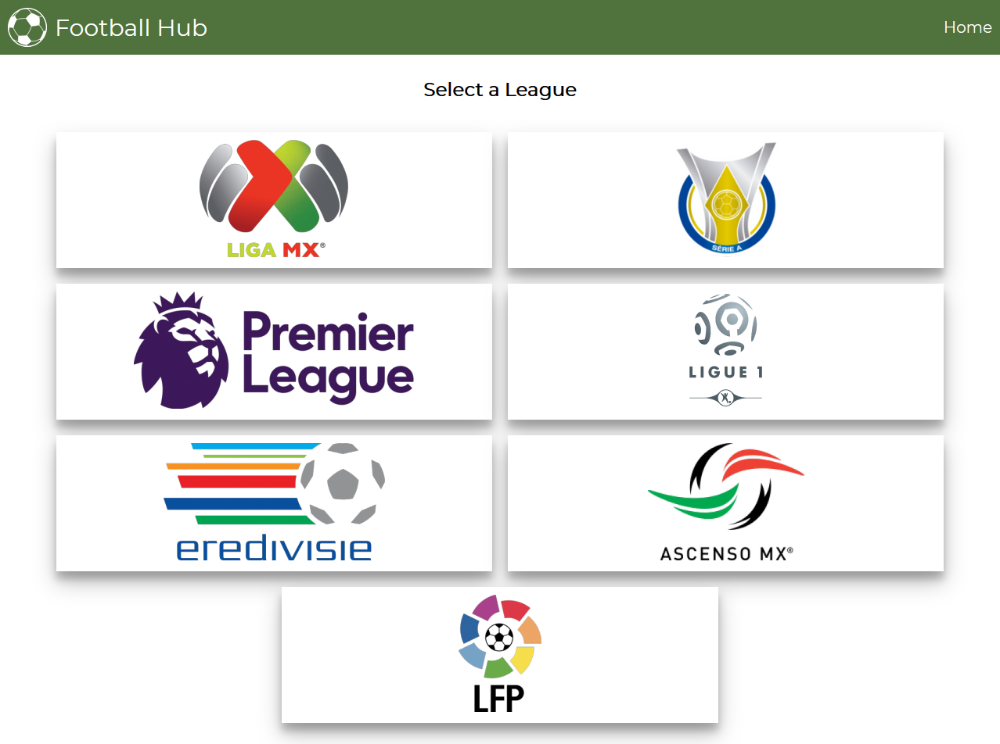
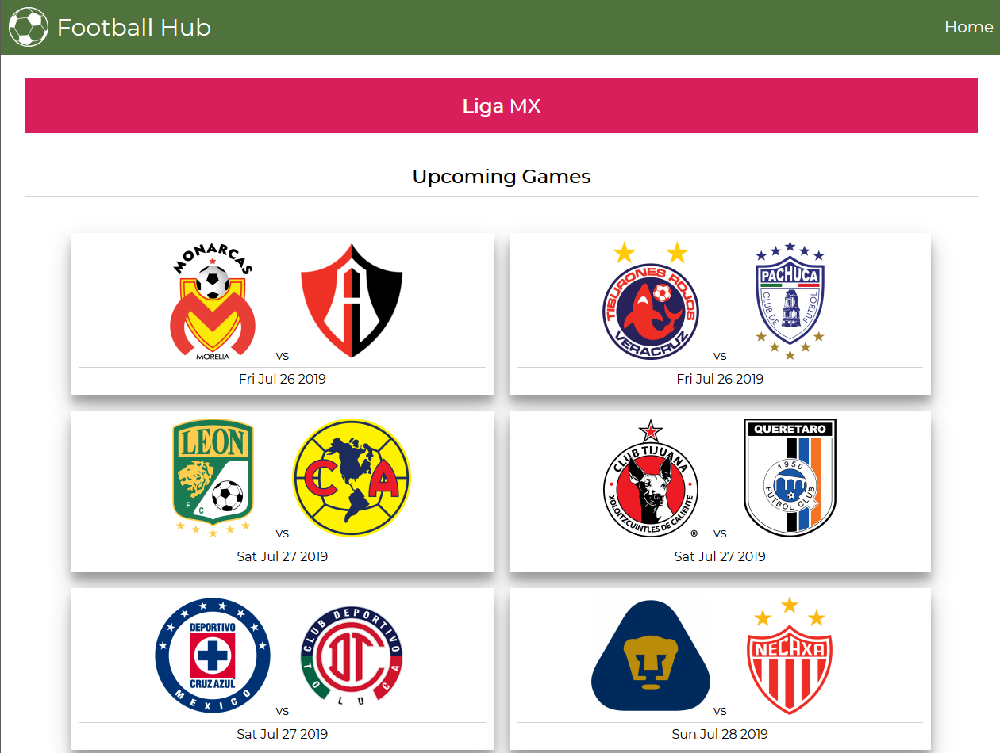
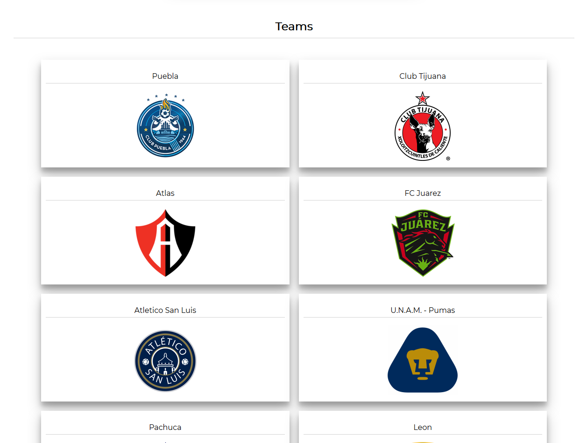

# Football Hub

## Summary 
An application that displays information for some soccer/football leagues from around world.
Some of the available information is: teams, current league standings, team rosters and the schedule for next round.

This application is used to showcase API integrations that require an API key. 

Live Application: [Click Here](https://caco0830.github.io/api-hack/)

## Technology Used

- HTML
- CSS
- Javascript
- jQuery

## Screenshots

Home Page:

Team View:

Teams:

